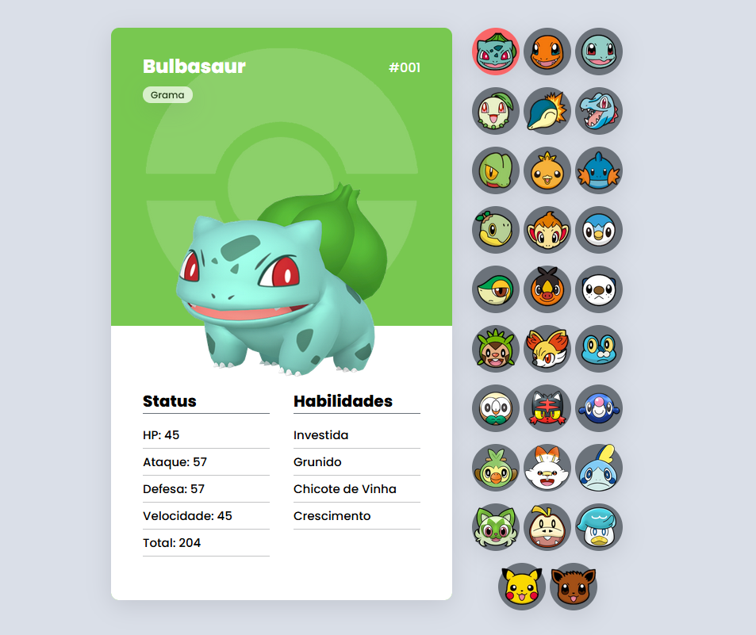

# StarterDex

Acesse o projeto <a href="https://vomoura.github.io/StarterDex/">aqui</a>.

## Descrição

Projeto de uma pokédex com todos os pokémons iniciais dos jogos da franquia criado junto com <a href="https://www.youtube.com/c/DevemDobro">Dev em Dobro</a>.

Update para versão 2.0 com os novos Pokémons da última geração.

## Linguagens Utilizadas
  
  HTML

  
 CSS

  
 JavaScript

## Layout 

